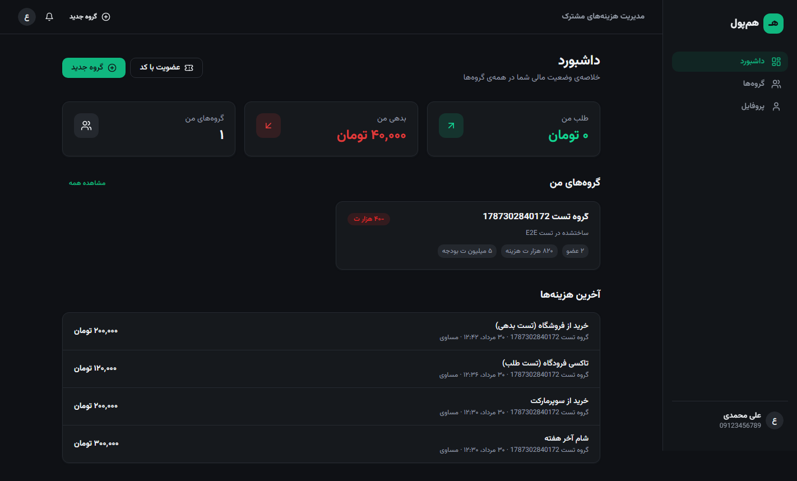
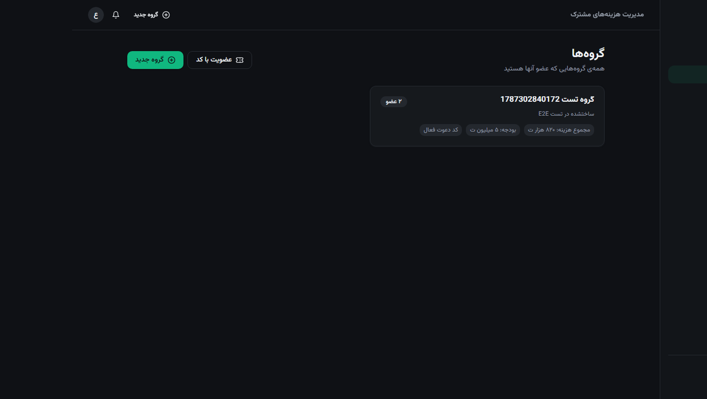
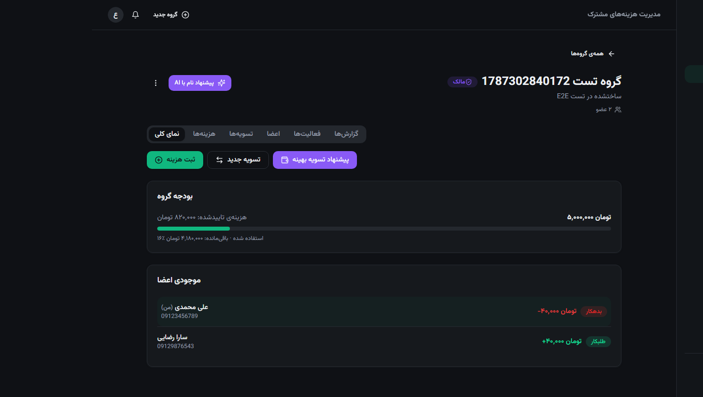
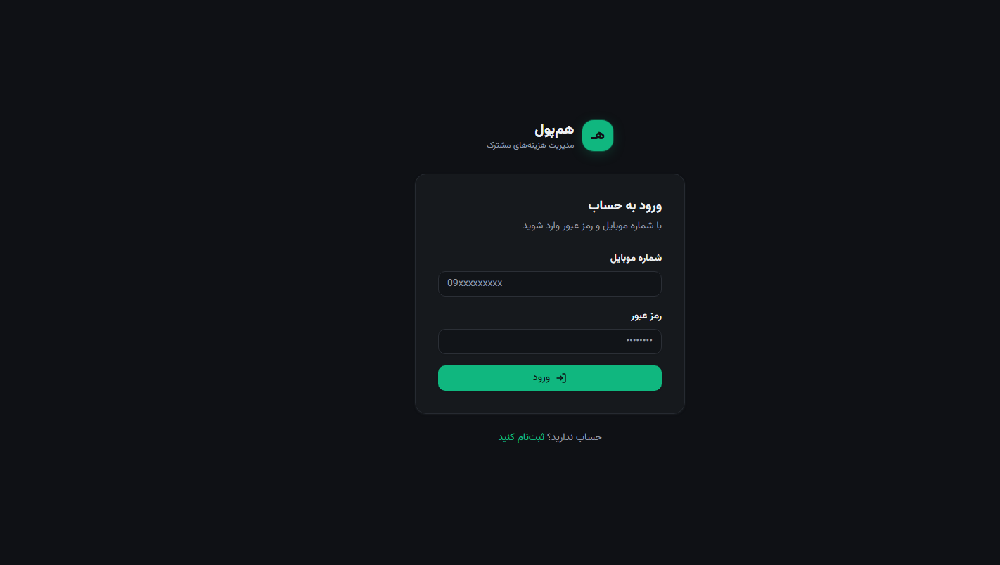

# هم‌پول — فرانت‌اند (HamPool Frontend)

فرانت‌اند وب برای پلتفرم مدیریت هزینه‌های مشترک **هم‌پول** — یک SPA مدرن، کاملاً **راست‌چین و فارسی** که با بک‌اند Django (همین مخزن) ارتباط برقرار می‌کند.

| | |
|---|---|
| **Framework** | React 18 + Vite + TypeScript (strict) |
| **Styling** | TailwindCSS با design tokens (دارک مود) + کامپوننت‌های shadcn/ui روی Radix |
| **Data** | TanStack Query · Axios (interceptor JWT با refresh خودکار) |
| **State** | Zustand (auth، اعلان‌ها) |
| **Forms** | React Hook Form + Zod |
| **Charts** | Recharts |
| **Real-time** | WebSocket manager (reconnect خودکار) برای اعلان‌های زنده |
| **Icons / Font** | lucide-react · Vazirmatn |

> 📄 مستندات تحلیل بک‌اند: [`API_SUMMARY.md`](./API_SUMMARY.md) — نقشه‌ی صفحات و وایرفریم: [`WIREFRAMES.md`](./WIREFRAMES.md)

---

## 🖼️ پیش‌نمایش

| داشبورد | گروه‌ها | جزئیات گروه | ورود |
|---|---|---|---|
|  |  |  |  |

---

## پیش‌نیازها

- Node.js 18+ (تست‌شده با ۲۴)
- بک‌اند هم‌پول در حال اجرا روی `http://localhost:8000` (برای اتصال کامل)

### اجرای بک‌اند (از ریشه‌ی مخزن)

```bash
cp .env.example .env      # مقادیر را پر کنید (GEMINI_API_KEY اختیاری)
docker compose up --build
docker compose exec django python manage.py migrate
docker compose exec django python manage.py createsuperuser
```

> ⚠️ بک‌اند برای رویدادهای Outbox به **Redis + Celery** نیاز دارد (docker compose هر دو را بالا می‌آورد). بدون آن‌ها برخی عملیات (ساخت گروه، ثبت هزینه و...) خطا می‌دهند.
>
> در محیط توسعه، **کد OTP** در کنسول بک‌اند چاپ می‌شود (هیچ SMS ای ارسال نمی‌شود).

---

## نصب و اجرا

```bash
cd frontend
npm install
npm run dev
```

برنامه روی **http://localhost:5173** بالا می‌آید. Vite به‌صورت خودکار این مسیرها را به بک‌اند پروکسی می‌کند (بدون نیاز به CORS):

- `/api` → `http://localhost:8000`
- `/media` → `http://localhost:8000`
- `/ws` (WebSocket) → `ws://localhost:8000`

### متغیرهای محیطی

فایل `.env.example` را کپی کنید (اختیاری — همه‌چیز با پیش‌فرض کار می‌کند):

```bash
cp .env.example .env
```

| متغیر | پیش‌فرض | توضیح |
|---|---|---|
| `VITE_API_BASE_URL` | `/api/v1/` | Base آدرس REST API |
| `VITE_WS_BASE_URL` | `''` (هم‌اورجین) | آدرس WebSocket؛ برای بک‌اند راه‌دور مثلاً `ws://localhost:8000` |
| `VITE_PROXY_TARGET` | `http://localhost:8000` | مقصد پروکسی توسعه |

---

## اسکریپت‌ها

```bash
npm run dev        # توسعه (Vite + proxy)
npm run build      # typecheck (tsc -b) + بیلد پروداکشن
npm run preview    # پیش‌نمایش بیلد
npm run lint       # ESLint (صفر هشدار)
npm run format     # Prettier
```

---

## ساختار پروژه (feature-based)

```
src/
  app/                # router، providers، layout اصلی (سایدبار RTL + ناوبری پایین موبایل)
  features/
    auth/             # ورود، ثبت‌نام ۲ مرحله‌ای OTP، پروفایل، استور توکن
    dashboard/        # خلاصه‌ی مالی، گروه‌ها، آخرین هزینه‌ها
    groups/           # گروه‌ها، جزئیات گروه (۶ تب)، هزینه‌ها، تسویه‌ها، اعضا، فعالیت‌ها، گزارش‌ها
    notifications/    # مرکز اعلان (WebSocket) + زنگوله
    misc/             # ۴۰۴
  shared/
    components/       # UI primitives (shadcn-style) + کامپوننت‌های مشترک
    hooks/            # useWebSocket (reconnect + backoff)
    lib/              # axios instance، فرمت‌های فارسی، خطاها، queryClient
    types/            # تایپ‌های کامل API
```

## صفحات

| مسیر | صفحه |
|---|---|
| `/login` · `/register` | ورود · ثبت‌نام ۲ مرحله‌ای (شماره + کد OTP) |
| `/` | داشبورد (طلب/بدهی من، گروه‌ها، آخرین هزینه‌ها) |
| `/groups` | لیست گروه‌ها + ساخت + عضویت با کد دعوت |
| `/groups/:id` | جزئیات گروه: نمای کلی · هزینه‌ها · تسویه‌ها · اعضا · فعالیت‌ها · گزارش‌ها |
| `/profile` | پروفایل (نام، ایمیل، زبان، آواتار، خروج) |

## محدودیت‌های شناخته‌شده (هماهنگ با بک‌اند فعلی)

- **چت گروهی وجود ندارد** — WebSocket فقط اعلان‌های یک‌طرفه‌ی «تغییر وضعیت گروه» است (رویدادها به‌صورت فارسی به مرکز اعلان می‌آیند و داده‌ها re-fetch می‌شوند).
- **اعلان‌ها سمت سرور ذخیره نمی‌شوند** — فقط در طول نشست در مرورگر می‌مانند.
- **2FA فقط برای ثبت‌نام** — کد OTP در کنسول بک‌اند چاپ می‌شود؛ QR و کد بازیابی وجود ندارد.
- **فراموشی رمز** اندپوینتی ندارد.
- **هوش مصنوعی** فقط «پیشنهاد نام گروه» است (از صفحه‌ی گروه قابل استفاده).
- **گزارش PDF** از طریق ایمیل ارسال می‌شود (دکمه‌ی درخواست در تب گزارش‌ها)؛ نمودارها را فرانت‌اند از داده‌ی واقعی می‌سازد.
- **ضمیمه‌ی رسید** (multipart) فعلاً در فرم هزینه پشتیبانی نمی‌شود.
